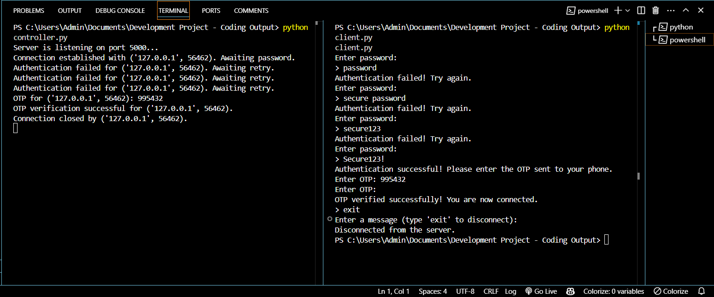

# Introduction

This project showcases a Python client-controller/hub application using the socket library, demonstrating secure communication and accountability in distributed systems. It emphasizes the importance of connectivity within the ABCDE architecture, highlighting potential vulnerabilities without using SSL for encryption.

Github https://github.com/anja-kosar/SSA-Development-Individual-Project/tree/main 

# Python Execution & Output

* Navigate to the directory "Controller.py" file and open a new terminal/command prompt. In terminal, type "python controller.py". This will execute the script and initiate the "controller/hub", confirming it is listening for connections on port 5000.
* Navigate to the directory "client.py" file and open a new terminal/command prompt. In terminal, type "python client.py". This will prompt the client to enter a password. For this project, a pre-set password has been stored (Secure123!), due to the word count limit. 
* Enter the correct password and if successful, the client will be prompted to check "phone device" for a one time password (OTP) which will be displayed on the server side. 
* Enter the OTP and a successful connection will be established. 

* For incorrect passwords, the client will be prompted to retry, and failed attempts will be logged.

* To end the session, in client terminal, type "exit". This will display the disconnection message. 

# Factors considered but not implemented in this project

Although the project successfully illustrated safe client-server communication, it can be made more robust and scalable with a few improvements, such as encryption libraries like AES or SSL/TLS, where data transfer would be secure and impenetrable (SSL, 2024). For this project, in the absence of encryption, adversaries could use methods like packet sniffing to intercept data being sent across the network. This enables adversaries to obtain private data in plaintext, including passwords, usernames, and other sensitive information (TurningSecure, 2024). Therefore, it is important that communication between client/server is encrypted. Another consideration is a database, which was not created for this project due to word count limit, which would have been encrypted separately using the SHA256 and Python salt libraries. Once the client attempts to log in, an authentication process would begin, where the entered value would be checked against the database, confirmed with OTP and then authenticated. This separate encryption, along with communication encryption would potentially secure from malicious attacks. 

# Python Libraries 

## Socket
Sockets and APIs facilitate inter-process communication (IPC) across networks, including physical and logical ones like the Internet, connecting computers through ISPs. (Realpython.com, 2018; Python, 2020).

## Logging
This module defines functions and classes which implement a flexible event logging system for applications and libraries (docs.python.org, N.D). Here, logging was implemented to keep a log of failed login attempts.

## DateTime

Python Datetime module supplies classes to work with date and time. They provide several functions to deal with dates, times, and time intervals (GeeksForGeeks, 2019; PythonSoftwareFoundation, 2002). Here the module was used to log failed login attempts.

## Regular Expressions (Re)

This project uses functions to check if a specific string matches a regular expression or if a given regular expression matches a specific string that matches the same pattern (Python, 2009). Here, it was used to check password standards are complied with.

## Random Library

For the purpose of generating an OTP, a random() function was used to generate random OTP which is predefined in random library (Python, N.D; GeeksForGeeks, 2018).

## String Library

The module offers various string manipulation functions and constants, including string library for creating random passwords for One-Time Password (OTP) systems, regular expressions for checking for special characters, and string library for checking for numbers, capital letters, and lowercase letters (GeeksForGeeks, 2024; docs.python.org, N.D).

## References:

SSL.com. (2024). What is an SSL/TLS Certificate? - SSL.com. [online] Available from: https://www.ssl.com/article/what-is-an-ssl-tls-certificate/. [Accessed 25 November 2024].

Realpython.com. (2018). Socket Programming in Python (Guide). [online] Available from: https://realpython.com/python-sockets/. [Accessed 25 November 2024].

Python (2020). socket — Low-level networking interface — Python 3.8.1 documentation. [online] Python.org. Available from: https://docs.python.org/3/library/socket.html. [Accessed 25 November 2024].

docs.python.org. (n.d.). logging — Logging facility for Python — Python 3.10.0 documentation. [online] Available from: https://docs.python.org/3/library/logging.html. [Accessed 25 November 2024].

GeeksforGeeks. (2019). Python datetime module. [online] Available from: https://www.geeksforgeeks.org/python-datetime-module/. [Accessed 25 November 2024].

Python Software Foundation (2002). Datetime — Basic Date and Time Types — Python 3.7.2 Documentation. [online] Python.org. Available from: https://docs.python.org/3/library/datetime.html. [Accessed 25 November 2024].

Python (2009). re — Regular expression operations — Python 3.7.2 documentation. [online] Python.org. Available from: https://docs.python.org/3/library/re.html. [Accessed 25 November 2024].

GeeksforGeeks. (2019). Password validation in Python - GeeksforGeeks. [online] Available from: https://www.geeksforgeeks.org/password-validation-in-python/. [Accessed 25 November 2024]. 

TuringSecure. (2024). Unencrypted Communications. [online] Available from: https://turingsecure.com/knowledge-base/issues/unencrypted-communications/ [Accessed 26 November 2024]. 

Python (n.d.). random — Generate pseudo-random numbers — Python 3.8.2 documentation. [online] docs.python.org. Available from: https://docs.python.org/3/library/random.html. [Accessed 26 November 2024]. 

‌GeeksforGeeks. (2018). Python Program to generate one-time password (OTP). [online] Available from: https://www.geeksforgeeks.org/python-program-to-generate-one-time-password-otp/. [Accessed 26 November 2024]. 

GeeksforGeeks (2024). Python String Module. [online] GeeksforGeeks. Available from: https://www.geeksforgeeks.org/python-string-module/ [Accessed 26 Nov. 2024]. [Accessed 26 November 2024]. 

‌docs.python.org. (n.d.). string — Common string operations — Python 3.9.1 documentation. [online] Available from: https://docs.python.org/3/library/string.html. [Accessed 26 November 2024]. 
 
‌

‌
‌

‌
‌
‌

‌

‌

‌

‌

‌

‌